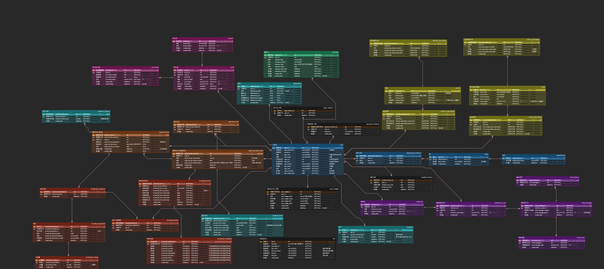
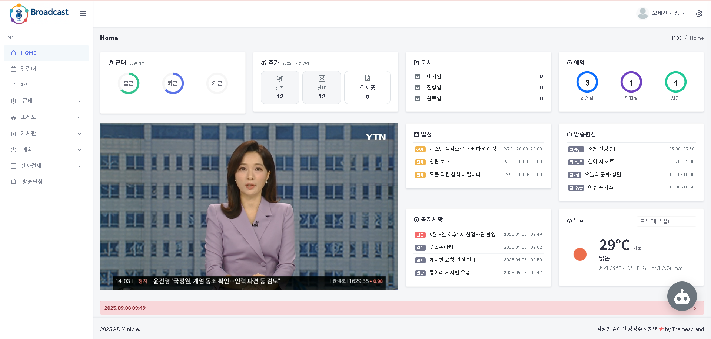
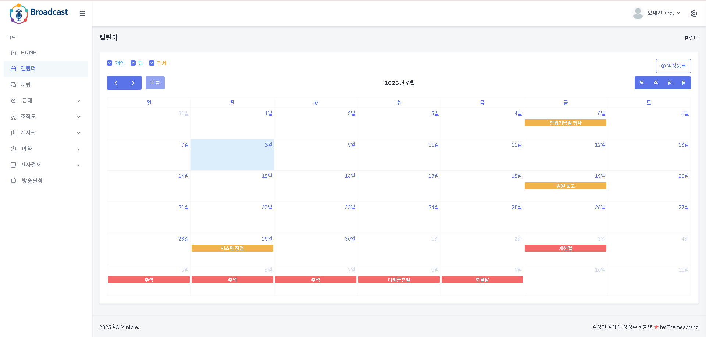
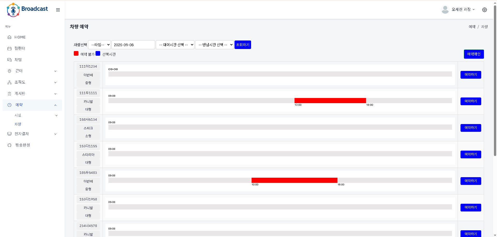
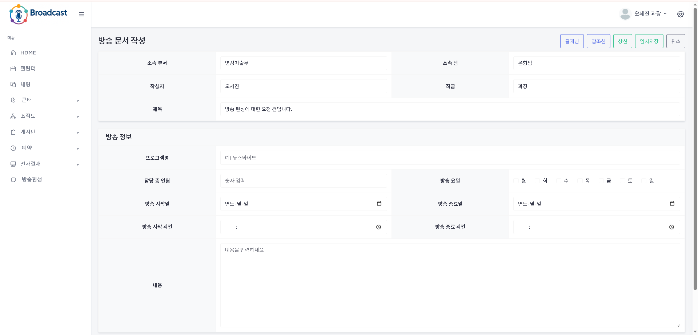
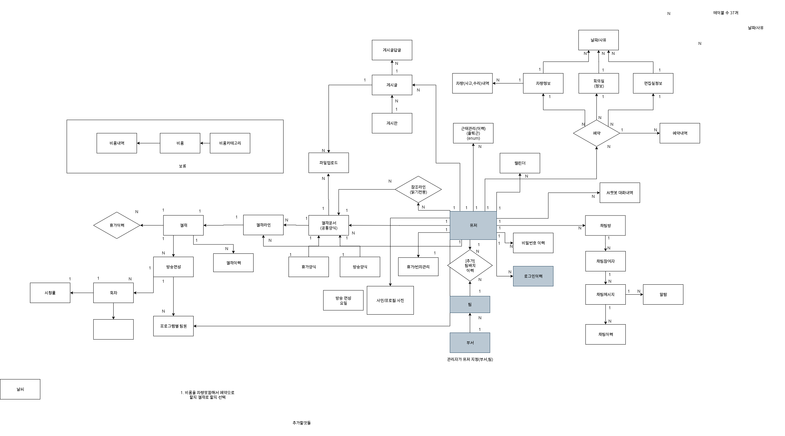

# 🛰️ Broadcast-Groupware

방송국 내부 업무 효율화를 위한 그룹웨어 시스템
캘린더, 예약, 근태, 게시판, 전자결재 등 방송국 업무를 통합 관리합니다.

# 🧩 프로젝트 개요

## 개발 목적

방송국 내부 업무를 웹으로 통합 관리하여 효율화

## 주요 특징

캘린더, 예약, 근태, 게시판, 전자결재 등 필수 업무 통합

역할 기반 기능 분리 (관리자 / 직원)

일정 알림, 예약 중복 방지, 결재 진행 상태 확인 등 업무 편의 기능 제공

# 👥 사용자 역할 및 기능

## 📌 관리자

 회원 관리 (직원, 결재자)

 회의실, 편집실, 차량 예약 관리

 캘린더 일정 등록/수정/삭제

 게시판 관리 및 공지사항 등록

 전자결재 확인 및 승인/반려 처리

## 👨‍💼 직원

 개인 일정 확인 및 관리

 예약 신청 (회의실, 편집실, 차량)

 근태 등록 (출근, 퇴근, 외근)

 게시판 글 작성/수정/삭제

 결재 문서 확인 및 서명 제출

# 🏗️ 기술 스택

| 구분 | 기술 |
|------|------|
| Language | Java 17 |
| Backend | Spring Boot |
| Frontend | JSP, JSTL, EL, jQuery |
| Database | MySQL |
| ORM | JPA / MyBatis |
| Build Tool | Maven |
| Server | Embedded Tomcat |
| 기타 | Lombok 등 |

# 📂 프로젝트 구조

broadcast-groupware/
├── src/
│   ├── main/java/com/broadcast/...
│   └── resources/
│       ├── application.properties
│       └── templates/ (Mustache/JSP)
├── pom.xml
└── mvnw / .gitignore / ...

# 🗃️ 데이터베이스 설계

사용자(user), 역할(role), 일정(calendar), 예약(reservation), 근태(attendance), 게시판(board), 결재(approval) 등

전자결재 문서 흐름, 결재자 서명 관리, 문서 상태 업데이트 반영

ERD 예시: 

# 🧾 주요 화면

| 화면 | 기능 |
|------|------|
| 🗓 캘린더 | 전체/팀/개인 일정 확인 |
| 🏢 예약 시스템 | 회의실, 편집실, 차량 예약 |
| ⏱ 근태 관리 | 출/퇴/외근 등록 |
| 📝 게시판 | 일반/공지사항 게시글 작성 |
| 🖊 전자결재 | 일반 문서, 방송 편성, 휴가 신청 |

| 메인화면 | 캘린더 | 차량예약 | 전자결재 |
|--------|--------|----------|----------|
|  |  |  |  |

# 🗺️ 기능 흐름도

관리자/직원 역할별 기능 흐름 및 CRUD 구조
FlowChart: 

